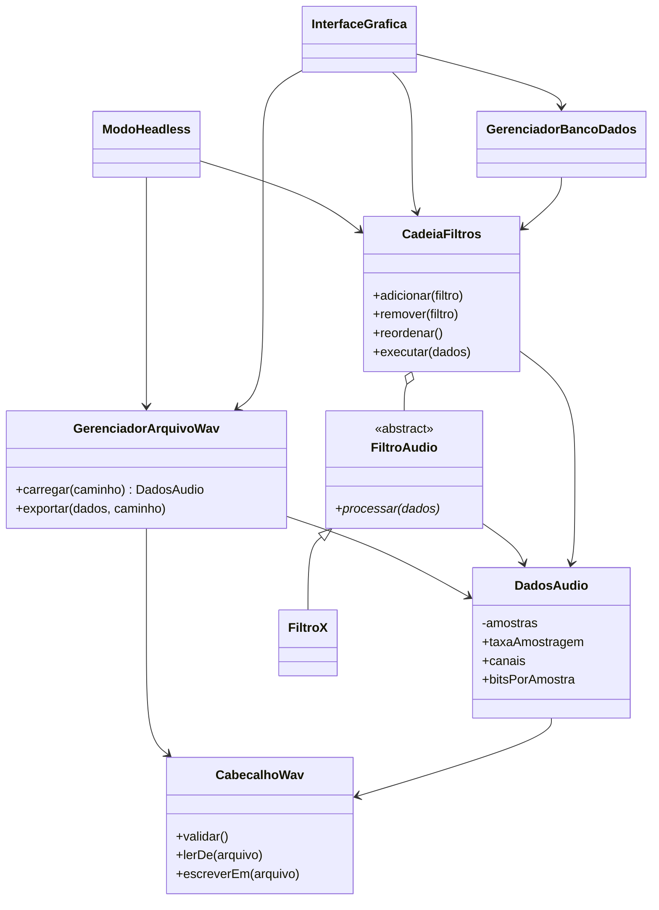

# 🎧 20262-team-2 — Processador Digital de Áudio UFV


Processador digital de áudio no formato **.wav**, focado em **acessibilidade auditiva** e **produção musical**. A aplicação lê o arquivo de som em binário, interpreta o cabeçalho WAV e aplica **filtros digitais** (ganho, distorção, eco, realce de frequências, limpeza de ruído) que podem ser **encadeados em sequência**, via **interface gráfica** ou **processamento em lote por scripts**.

---

## 👥 Integrantes

| Nome | Matrícula | GitHub |
|------|-----------|--------|
| Arthur Saraiva Alves | 124665 | [@arthursaraivadev13](https://github.com/arthursaraivadev13) |
| Caio Guilherme Gonzaga Silvestre | 124679 | [@caioggs-quasedev](https://github.com/caioggs-quasedev) |
| Matheus Borges Nery De Mingo | 124675 | [@matheusdemingo](https://github.com/matheusdemingo) |
| Daniel Martins Teixeira | 124673 | [@DanielMT-UFV](https://github.com/DanielMT-UFV) |
| Rafael Vagner Pinto da Fonseca Souza | 124680 | [@RafaelVagner1F0](https://github.com/RafaelVagner1F0) |

---

## 📌 Sumário

- [Integrantes](#-integrantes)
- [Sobre o projeto](#-sobre-o-projeto)
  - [Motivação](#-motivação)
  - [Funcionalidades](#-funcionalidades)
  - [Filtros](#-filtros)
  - [Modos de operação](#-modos-de-operação)
- [Arquitetura](#-arquitetura)
  - [Diagrama de classes](#diagrama-de-classes)
  - [Responsabilidades](#responsabilidades-das-classes)
- [User Stories](#-user-stories)
- [Estrutura do repositório](#-estrutura-do-repositório)
- [Tecnologias](#-tecnologias)
- [Como compilar e executar](#-como-compilar-e-executar)
- [Exemplo de script em lote](#-exemplo-de-script-em-lote)
- [Roadmap](#-roadmap)

---

## 🎵 Sobre o projeto

### 🎯 Motivação

O projeto atende dois públicos:

- 🦻 **Pessoas com deficiência auditiva:** filtros que aumentam o ganho nas faixas de frequência onde há perda auditiva e que atenuam ruídos fora da faixa da fala humana, melhorando a inteligibilidade.
- 🎛️ **Produtores musicais:** filtros e efeitos criativos (distorção, eco/delay, ganho) para tratar áudios usados em shows e outras mídias.

### ✨ Funcionalidades

- Leitura de arquivos `.wav` com **validação do cabeçalho** (marcadores `RIFF` e `WAVE`, 44 bytes iniciais).
- **Exportação** do áudio processado, com escolha de nome/caminho e opção segura de sobrescrever o original.
- **Cadeia de filtros** (`CadeiaFiltros`): a saída de um filtro é a entrada do próximo; é possível adicionar, remover e reordenar antes de executar.
- Processamento **inteiramente em RAM**, com alocação dinâmica sob medida e liberação segura da memória (inclusive em caso de exceção).
- **Interface gráfica** com controles interativos e alertas de erro amigáveis.
- **Modo headless (lote)** via scripts `.txt`, com validação de sintaxe e relatório de sucesso/falha por arquivo.
- **Perfis e presets** de cadeias de filtros persistidos em banco de dados.

### 🔊 Filtros

| Filtro | Público | Descrição |
|--------|---------|-----------|
| Ganho de volume | Geral | Amplifica ou atenua a amplitude do sinal |
| Distorção | Produção musical | Altera a forma de onda para efeito criativo |
| Eco / Delay | Produção musical | Repete o sinal com atraso e atenuação |
| Realce por frequência | Acessibilidade | Aumenta o ganho em faixas onde o usuário tem perda auditiva |
| Limpeza de ruído | Acessibilidade | Atenua sons fora da faixa de frequência da fala humana |

> Todos os filtros herdam de `FiltroAudio` e implementam o método `processar()`. Após qualquer processamento, o áudio permanece dentro das especificações do formato `.wav`.

### 🕹️ Modos de operação

| Modo | Descrição |
|------|-----------|
| **Interativo (GUI)** | O usuário escolhe o arquivo de entrada e o de saída, monta a cadeia de filtros, ajusta parâmetros (ganho, frequência de corte etc.), visualiza a cadeia e executa. Erros aparecem em pop-ups. |
| **Headless (lote)** | Lê um script `.txt` com comandos de carregamento, aplicação de filtros e exportação, executa sequencialmente e informa o progresso e o status final de cada arquivo no terminal. |

---

## 🏗️ Arquitetura

### Diagrama de classes



### Responsabilidades das classes

| Classe | Responsabilidade |
|--------|------------------|
| `CabecalhoWav` | Estrutura, valida e manipula os 44 bytes do cabeçalho; fornece os parâmetros do formato |
| `DadosAudio` | Guarda as amostras em RAM, garante alocação/liberação segura e expõe os metadados |
| `GerenciadorArquivoWav` | Lê e grava arquivos WAV; trata exceções (arquivo inexistente, permissão, corrupção) |
| `FiltroAudio` *(abstrata)* | Molde comum a todos os filtros |
| `FiltroX` *(derivadas)* | Implementam `processar()` com a manipulação específica de cada filtro |
| `CadeiaFiltros` | Fila ordenada de filtros; adicionar, remover, reordenar e executar em sequência |
| `ModoHeadless` | Interpreta scripts `.txt`, converte em comandos e executa o lote |
| `InterfaceGrafica` | Renderiza a GUI, captura interações e exibe estado, cadeia e alertas |
| `GerenciadorBancoDados` | Persiste perfis e presets e os converte em instâncias de `CadeiaFiltros` |

---

## 📖 User Stories

| # | Ator | Objetivo |
|---|------|----------|
| 1 | Usuário | Carregar `.wav` e ter o cabeçalho interpretado e validado |
| 2 | Usuário | Exportar o áudio processado em um novo arquivo |
| 3 | Usuário | Processar arquivos extensos com segurança e sem vazamentos de memória |
| 4 | Produtor musical | Aplicar filtros e efeitos para shows e mídias |
| 5 | Pessoa com deficiência auditiva | Melhorar a inteligibilidade do som |
| 6 | Usuário | Encadear filtros em sequência |
| 7 | Usuário | Processar arquivos em lote via scripts `.txt` |
| 8 | Usuário | Usar o programa por interface gráfica |
| 9 | Usuário | Salvar perfil e presets de filtros em banco de dados |

Os critérios de aceitação completos e os Cartões CRC estão em [`docs/`](docs/).

---

## 📁 Estrutura do repositório

> ⚠️ A ser atualizada conforme o andamento do projeto.

```text
20262-team-2/
├── docs/
│   └── User Stories e Cartões CRC
├── src/
├── include/
├── data/            # áudios de exemplo e scripts de lote
└── README.md
```

---

## 🛠️ Tecnologias

| Categoria | Ferramenta |
|-----------|------------|
| Linguagem | C++ |
| Formato de áudio | WAV (PCM) |
| Interface gráfica | a definir |
| Banco de dados | a definir |
| Build | a definir |
| Controle de versão | Git / GitHub |

---

## 🚀 Como compilar e executar

> ⚠️ A ser adicionado conforme o andamento do projeto.

```bash
# Modo interativo (GUI)
./audio_processor

# Modo headless (lote)
./audio_processor --headless scripts/lote.txt
```

---

## 📝 Exemplo de script em lote

> A sintaxe final ainda será definida; este é apenas um esboço do formato esperado.

```text
carregar entrada/aula01.wav
filtro ganho 1.5
filtro limpeza_ruido
exportar saida/aula01_tratada.wav
```

Saída esperada no terminal:

```text
[1/1] aula01.wav ... OK
Resumo: 1 sucesso, 0 falhas
```

---

## 🗺️ Roadmap

- [ ] Leitura e validação do cabeçalho WAV
- [ ] Exportação de arquivos
- [ ] Filtros básicos (ganho, distorção, eco)
- [ ] Filtros de acessibilidade (realce por frequência, limpeza de ruído)
- [ ] Cadeia de filtros
- [ ] Modo headless
- [ ] Interface gráfica
- [ ] Perfis e presets em banco de dados

---

Projeto final de Programação II (INF 112) — Universidade Federal de Viçosa (UFV)
